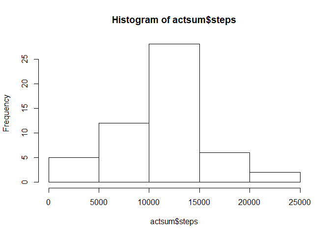
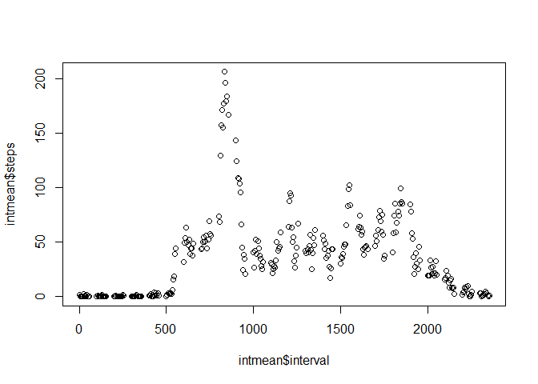
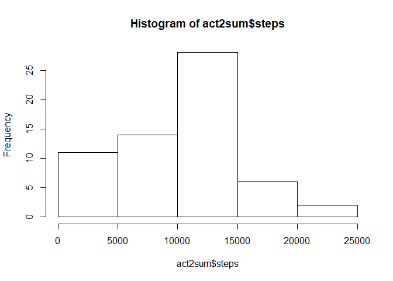
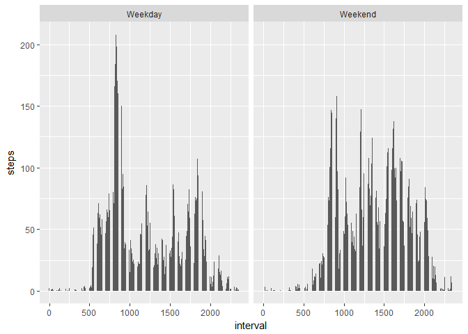

    knitr::opts_chunk$set(echo = TRUE)

The following program utilizes acitivity tracker data.

First we need to load in and preprocess the dataset from our working
directory:

    #load data.table library
    library(data.table)
    #load in csv
    act <- read.csv(file="activity.csv", header=TRUE, na.strings='NA')
    #transform date var to date
    act$date <- as.Date(act$date, format = "%m/%d/%Y")
    #transform data into data.table to allow data.table functions
    act <- data.table(act)

**What is the mean total number of steps taken per day?**

    #calculate sum of steps by day
    actsum <- act[,sum(steps), by = date]
    colnames(actsum)[2] <- 'steps'

    #create a histogram of the average by day
    hist(actsum$steps)

    #calculate average of total daily steps
    meanday <- mean(actsum$steps, na.rm=TRUE)
    print(meanday)

    ## [1] 10766.19

    #calculate median of total daily steps
    medday <- median(actsum$steps, na.rm=TRUE)
    print(medday)

    ## [1] 10765

The average total daily steps is **10766.19** and the median total daily
steps is **10765**

**What is the average daily activity pattern?**

    #find the average number of steps taken at each interval

    intmean <- aggregate(act, by=list(act$interval), mean, na.rm=TRUE)

    #time series plot of the mean number of steps taken each day
    plot(intmean$interval,intmean$steps)

    #find the interval with the maximum number of steps on average

    #return the interval with the max average steps
    intmax <- intmean[which.max(intmean$steps),]$interval

The interval with the maximum average steps is **835**

    countmissing <- sum(is.na(act$steps))

There are 2304 missing values.

***Impute missing values*** *We impute using knn which will find the 10
closest neighbors in terms of intervals and date and impute the missing
values. This helps since days and interval both seem to have a
relationship with steps*

    #to install source("https://bioconductor.org/biocLite.R")
    #biocLite("impute")
    library(impute)
    #we will use the k-nearest neighbors to impute missing. This uses the 10 closest neighbors
    act2 <- data.matrix(act)
    act2 <- data.table(impute.knn(act2)$data)

    ## Cluster size 17568 broken into 8784 8784 
    ## Cluster size 8784 broken into 4445 4339 
    ## Cluster size 4445 broken into 2250 2195 
    ## Cluster size 2250 broken into 1050 1200 
    ## Done cluster 1050 
    ## Done cluster 1200 
    ## Done cluster 2250 
    ## Cluster size 2195 broken into 862 1333 
    ## Done cluster 862 
    ## Done cluster 1333 
    ## Done cluster 2195 
    ## Done cluster 4445 
    ## Cluster size 4339 broken into 2195 2144 
    ## Cluster size 2195 broken into 980 1215 
    ## Done cluster 980 
    ## Done cluster 1215 
    ## Done cluster 2195 
    ## Cluster size 2144 broken into 2044 100 
    ## Cluster size 2044 broken into 1174 870 
    ## Done cluster 1174 
    ## Done cluster 870 
    ## Done cluster 2044 
    ## Done cluster 100 
    ## Done cluster 2144 
    ## Done cluster 4339 
    ## Done cluster 8784 
    ## Cluster size 8784 broken into 4401 4383 
    ## Cluster size 4401 broken into 2275 2126 
    ## Cluster size 2275 broken into 2007 268 
    ## Cluster size 2007 broken into 844 1163 
    ## Done cluster 844 
    ## Done cluster 1163 
    ## Done cluster 2007 
    ## Done cluster 268 
    ## Done cluster 2275 
    ## Cluster size 2126 broken into 929 1197 
    ## Done cluster 929 
    ## Done cluster 1197 
    ## Done cluster 2126 
    ## Done cluster 4401 
    ## Cluster size 4383 broken into 2187 2196 
    ## Cluster size 2187 broken into 976 1211 
    ## Done cluster 976 
    ## Done cluster 1211 
    ## Done cluster 2187 
    ## Cluster size 2196 broken into 1220 976 
    ## Done cluster 1220 
    ## Done cluster 976 
    ## Done cluster 2196 
    ## Done cluster 4383 
    ## Done cluster 8784

    #fix date variable
    act2$date <- as.Date(act2$date, origin = "1970-01-01")

Find the total number of steps taken each day after imputation and
report the mean and median.

**Imputing Missing Values**

    #calculate sum of steps by day
    act2sum <- act2[,sum(steps), by = date]
    colnames(act2sum)[2] <- 'steps'

    hist(act2sum$steps)

    meanimputsteps <- mean(act2sum$steps)
    medianimputsteps <- median(act2sum$steps)

The average number of steps taken each day after imputation is
**10002.74** and the median is **10395**.

    diffmean <- meanimputsteps-meanday
    diffmedian <- medianimputsteps-medday

Before imputing the missing values, the mean is **10766.19**, after
imputation the mean is **10002.74**. This is a difference of
**-763.4455**. In contrast, the original median is **10765** and the
imputed median is **10395**. This is a difference of **-370**.

***Are there differences in activity patterns between weekdays and
weekends?***

    #find day of week
    act2$day <- as.numeric(format(act2$date, format = "%u"))

    act2$daytype <- ifelse((act2$day == 6) | (act2$day==7), "Weekend", "Weekday")

    #panel plot
    library(ggplot2)
    ggplot(act2, aes(x=interval, y=steps)) +
      stat_summary(fun.y = mean,
                   geom = "bar") +
      facet_grid(.~act2$daytype)

